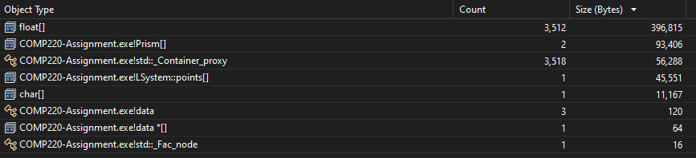
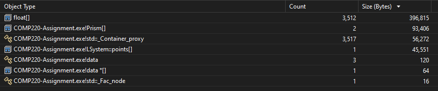
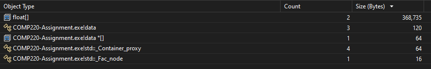
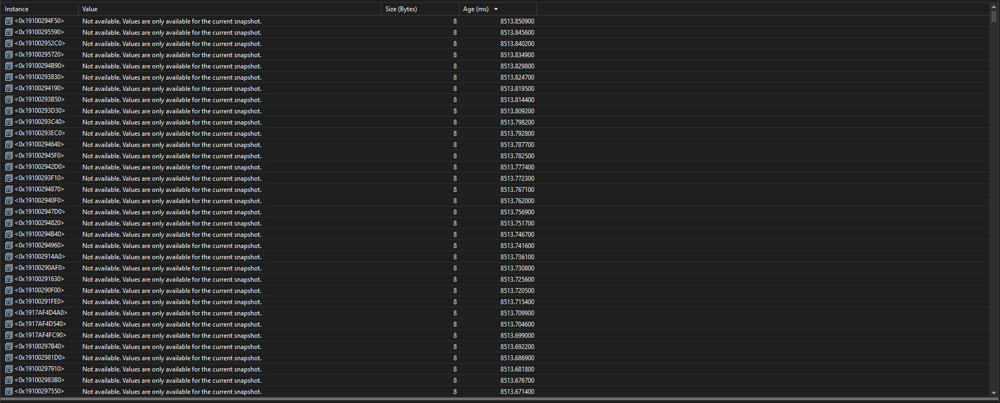
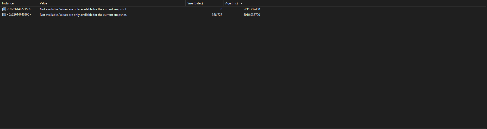

# Optimisation and Profiling

 
[Fig.1 Stack and memory usage prior to optimisation]

Prior to optimisation I ran my program with a recursion count of 4 and profiled the results in order to find any excess memory usage that could be cut back on. As you can see in figure one, a large portion of the memory is being used on the vectors of floats that are representing points within my program. Another point of concern was the large size of the string which would continue to expand rapidly due to the nature of recursive algorithms.

 

 
[Fig.2 Stack and memory usage after string optimisation]

In order to remove the extraneous memory storing the string after it had been used I moved the declaration of the 'currentString' variable into the arguments for my recursive function. This leads to an increase in memory usage during the construction of the L-System because all instances of the 'currentString' variable exist in parallel, however, after the functions break the variable goes out of scope and is deleted, clearing up memory.

 

 
[Fig.3 Stack and memory usage after scope optimisation]

 
[Fig.4 Instances of float vectors prior to scope optimisation]

 
[Fig.5 Instances of float vectors after scope optimisation]

It was difficult to find a way to have the instances of the 'Prism' class fall out of scope while preserving access to the information needed in order to construct the image on screen. However to achieve this I found that I could make a new scope around the area within 'main' where I was creating the instances of the 'Prism' class and where I was extracting the data from it. This meant that once it was no longer in use, it fell out of scope and was subsequently deleted.
